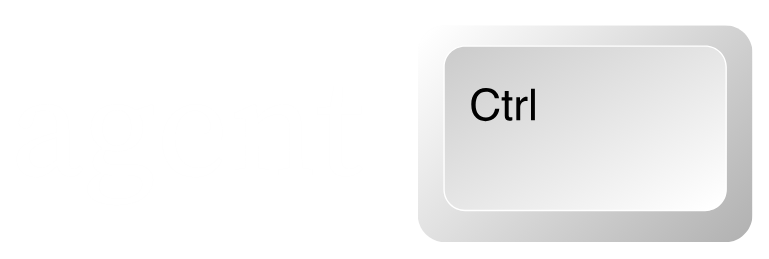

<p align="center">
  
</p>

<p align="center">
  OS automation CLI for AI agents. Fast native Rust CLI.
</p>

> **Status (v0.1.0):** **Windows is the supported platform today.** The Windows UI Automation surface is feature-complete and validated end-to-end against real apps. macOS Accessibility (AX), Linux AT-SPI, Chromium DevTools Protocol (CDP), Android, and iOS surfaces are scaffolded - they implement the `Surface` trait and compile cleanly, but their methods return `Unsupported`. Filling them in is the v0.x roadmap.

## Installation

### From source (recommended for v0.1)

```bash
git clone https://github.com/k4cper-g/agent-ctrl
cd agent-ctrl
cargo build --release -p agent-ctrl-cli
# put target/release/agent-ctrl on your PATH
```

### TypeScript client

```bash
npm install @agent-ctrl/client
# expects `agent-ctrl` on PATH for the daemon transport
```

### Requirements

- **Windows 10/11** for UIA. Other OSes build cleanly but their surfaces return `Unsupported`.
- **Rust 1.85+** (workspace MSRV; rustup will install it from `rust-toolchain.toml`).
- **Node.js 20+** only when using the TypeScript client.

## Quick start

```bash
agent-ctrl info                                  # OS, available surfaces, active sessions
agent-ctrl open uia                              # spawn a daemon (background)
agent-ctrl snapshot --target-process Notepad     # tree of refs (@e0, @e1, ...)
agent-ctrl click @e4                             # click by ref
agent-ctrl fill @e0 "hello from agent-ctrl"      # set value via UIA ValuePattern
agent-ctrl press "Ctrl+S"                        # key chord via SendInput
agent-ctrl screenshot result.png                 # PNG of the pinned window
agent-ctrl close                                 # stop the daemon
```

Every action follows the same pattern: `snapshot` once to learn what's on screen, then issue actions by ref. Refs are valid only for the snapshot that produced them - re-snapshot before acting on a tree that has changed.

## Commands

### Core

```bash
agent-ctrl open <surface>                # spawn a daemon (uia, mock, ...)
agent-ctrl close                         # stop the daemon
agent-ctrl list                          # active sessions
agent-ctrl info [--json]                 # static facts about this binary
agent-ctrl doctor [--json] [--fix] [--quick]  # diagnose the install + live probe
agent-ctrl launch <path> [--wait MS]     # spawn an app detached from this shell
```

### Snapshot

```bash
agent-ctrl snapshot                              # capture pinned window's a11y tree
agent-ctrl snapshot --target-process <name>      # pin by process executable name
agent-ctrl snapshot --target-pid <pid>           # pin by PID
agent-ctrl snapshot --target-title <substring>   # pin by window title (locale-dependent)
agent-ctrl snapshot --json                       # full JSON for programmatic consumption
agent-ctrl snapshot --compact false              # disable compact-tree filtering
```

The first `snapshot` after `open` pins the session to a target window. Subsequent actions on the session target that window until a `focus-window` re-pins it.

### Pointer / focus

```bash
agent-ctrl click @eN                     # primary-button click on a ref
agent-ctrl double-click @eN              # double-click
agent-ctrl right-click @eN               # secondary-button click
agent-ctrl hover @eN                     # cursor over element, no buttons
agent-ctrl focus @eN                     # UIA SetFocus
```

### Keyboard

```bash
agent-ctrl type "hello"                  # synthetic Unicode keystrokes (ASCII reliable; no IME)
agent-ctrl fill @eN "value"              # UIA ValuePattern.SetValue (best for non-ASCII / form fields)
agent-ctrl press "Ctrl+S"                # key chord - Enter, Tab, Ctrl+A, Ctrl+Shift+T, etc.
agent-ctrl key-down "Shift"              # hold a modifier
agent-ctrl key-up "Shift"                # release it
```

### Selection / scroll

```bash
agent-ctrl select @eN "Option name"      # pick an item in a select / combo / list
agent-ctrl select-all [@eN]              # select all in field; without ref, sends Ctrl+A to focus
agent-ctrl scroll <DX> <DY> [--ref @eN]  # wheel scroll (positive DY = down)
agent-ctrl scroll-into-view @eN          # UIA ScrollItemPattern
agent-ctrl drag @eFROM @eTO              # source-to-destination drag
```

### Find

```bash
agent-ctrl find "Save"                   # case-insensitive substring on name
agent-ctrl find "Save" --role button     # narrow by role (kebab-case)
agent-ctrl find "Save" --exact           # case-sensitive equality
agent-ctrl find --role menu-item         # all nodes of a role; no name filter
agent-ctrl find "OK" --in @e2            # restrict to subtree under @e2
agent-ctrl find "Save" --first           # bare ref for shell substitution
agent-ctrl find --limit 5                # cap result count
```

`find` queries the *cached* snapshot - it does not re-walk the OS tree. With no match, writes `no match` to stderr and exits non-zero. `--first` prints just `@eN` so the canonical "find then act" pattern composes:

```bash
agent-ctrl click "$(agent-ctrl find "Save" --role button --first)"
```

### Wait

```bash
agent-ctrl wait <MS>                                # dumb sleep on the daemon worker
agent-ctrl wait-for "Save" --role button            # wait for a node to appear
agent-ctrl wait-for "Loading..." --gone             # wait for a node to disappear
agent-ctrl wait-for --stable [--idle-ms 500]        # wait for the tree signature to settle
agent-ctrl wait-for ... --timeout 10000 --poll 250  # tune the poll loop
```

Three reliability tiers. Use `--stable` after a click to let the UI settle before the next action. Exit codes: 0 satisfied, 1 bad args, 2 timeout - branch on those in shell pipelines instead of parsing strings.

### Windows

```bash
agent-ctrl window-list                            # all top-level windows owned by the pinned process
agent-ctrl window-list --first-other              # bare hex id of the first non-pinned window
agent-ctrl focus-window <hex_id>                  # bring a window to the foreground; re-pins the session
agent-ctrl switch-app <app_id>                    # foreground by app id (path or bare exe name)
```

When a Save As dialog or popup menu appears as a sibling top-level window, `window-list` is how you find it. `focus-window` re-pins so subsequent `snapshot` / `find` / actions target the dialog. Mirrors agent-browser's `tab_list` / `tab_switch`.

```bash
agent-ctrl press "Ctrl+S"                                 # opens Save As as a sibling HWND
agent-ctrl focus-window "$(agent-ctrl window-list --first-other)"
agent-ctrl snapshot                                       # now sees the dialog
agent-ctrl click "$(agent-ctrl find "Zapisz" --role button --first)"
```

### Output

```bash
agent-ctrl screenshot                            # PNG of the pinned window to a temp path
agent-ctrl screenshot result.png                 # to a specific path
agent-ctrl screenshot --region X,Y,W,H           # crop in physical screen pixels
```

## Sessions

Run multiple isolated UIA sessions side by side:

```bash
agent-ctrl open uia --session app1
agent-ctrl open uia --session app2

agent-ctrl snapshot --session app1 --target-process Notepad
agent-ctrl snapshot --session app2 --target-process Calc

agent-ctrl list
# SESSION         SURFACE   PID         ENDPOINT
# app1            uia       12345       127.0.0.1:54001
# app2            uia       12346       127.0.0.1:54002

agent-ctrl close --session app1
agent-ctrl close --session app2
```

The default session is `default`, so most commands need no flag. Each session has its own daemon process, pinned target window, cached snapshot, and refs. Session metadata lives at `~/.agent-ctrl/<name>.json` while the daemon is running.

## Mock surface

The `mock` surface returns a fixed two-button window - handy for testing the protocol without UIA permissions or a target app:

```bash
agent-ctrl open mock
agent-ctrl snapshot
agent-ctrl click @e0
agent-ctrl close
```

Available on every OS, no setup required. Used by the integration tests under `packages/client/tests/`.

## TypeScript client

```typescript
import { AgentCtrl } from "@agent-ctrl/client";

const ctrl = new AgentCtrl();              // spawns `agent-ctrl daemon` over stdio
const session = await ctrl.openSession("uia");

await ctrl.snapshot(session, {
  target: { by: "process-name", name: "Notepad" },
});

const matches = await ctrl.find(session, {
  name: "Save",
  role: "button",
});

await ctrl.act(session, { kind: "click", ref_id: matches[0]!.ref_id });

const outcome = await ctrl.waitFor(session, {
  predicate: { kind: "stable", idle_ms: 500 },
  timeout_ms: 5000,
  poll_ms: 250,
});

await ctrl.closeSession(session);
await ctrl.close();
```

Method surface: `openSession`, `snapshot`, `act`, `find`, `waitFor`, `listWindows`, `closeSession`, `close`. Both transports (shell CLI and stdio TypeScript) talk the same wire protocol; agents can mix and match.

See [packages/client/README.md](packages/client/README.md) for the full API.

## Architecture

agent-ctrl uses a client-daemon architecture mirroring agent-browser:

1. **Rust CLI** (`crates/cli`) - parses commands, dials the daemon, prints results.
2. **Rust daemon** (`crates/daemon`) - long-running process that owns surface sessions and dispatches snapshot / action / find / wait / list-windows requests.
3. **Surface trait** (`crates/core`) - cross-platform contract every backend implements. Per-platform crates (`crates/surface-uia`, `surface-ax`, `surface-cdp`) provide the implementations, gated by `target_os`.

The daemon starts via `agent-ctrl open <surface>` and persists across CLI invocations for fast subsequent operations. Each session has its own daemon process and writes a discovery file at `~/.agent-ctrl/<session>.json`.

## Workspace layout

The repository is a **dual workspace** - a Cargo workspace for the Rust engine and an npm workspace for the TypeScript client.

| Crate / package | Purpose |
|---|---|
| [`crates/core`](crates/core) | Shared types and the `Surface` trait. Schema, role taxonomy, action vocabulary, errors. |
| [`crates/daemon`](crates/daemon) | Long-running process that owns surface sessions and dispatches actions. |
| [`crates/cli`](crates/cli) | The `agent-ctrl` binary - user-facing entrypoint. |
| [`crates/surface-uia`](crates/surface-uia) | Windows UI Automation surface (Windows-only). |
| [`crates/surface-cdp`](crates/surface-cdp) | Chromium-via-CDP surface (scaffolded; cross-platform). |
| [`crates/surface-ax`](crates/surface-ax) | macOS Accessibility surface (scaffolded; macOS-only). |
| [`packages/client`](packages/client) | `@agent-ctrl/client` - typed TypeScript wrapper over stdio JSON-RPC. |

Surfaces gated by `target_os` compile to empty crates on other platforms, so the workspace builds on any host.

## Platforms

A **surface** is one accessibility protocol - UIA, AX, CDP, etc. A **platform** is an operating system. They aren't 1-to-1: most platforms can be driven by more than one surface, and CDP spans every OS Chrome runs on.

| Platform | Native surface | Browser surface | Status |
|---|---|---|---|
| Windows | [`surface-uia`](crates/surface-uia) - UI Automation | [`surface-cdp`](crates/surface-cdp) - Chrome / Edge via CDP | **uia: ready** · cdp: scaffolded |
| macOS | [`surface-ax`](crates/surface-ax) - Accessibility / AX | [`surface-cdp`](crates/surface-cdp) - Chrome via CDP | both scaffolded |
| Linux | _planned_ `surface-atspi` (AT-SPI / D-Bus) | [`surface-cdp`](crates/surface-cdp) - Chrome via CDP | cdp scaffolded |
| Android | _planned_ `surface-accessibility-service` (JNI) | [`surface-cdp`](crates/surface-cdp) - Chrome via CDP | cdp scaffolded |
| iOS | _planned_ `surface-xcuitest` (WebDriverAgent) | [`surface-cdp`](crates/surface-cdp) - limited | cdp scaffolded |

Acronyms in one line: **UIA** = Microsoft UI Automation, **AX** = macOS Accessibility, **AT-SPI** = the Linux GNOME accessibility bus, **CDP** = Chrome DevTools Protocol, **XCUITest** = Apple's UI test framework.

## Build

```bash
cargo check --workspace                          # fast type-check
cargo build --release -p agent-ctrl-cli          # the binary
cargo test --workspace                           # all unit + integration tests
cargo clippy --workspace --all-targets -- -D warnings   # lint, fail on warnings
cargo fmt --all -- --check                       # format check
```

TypeScript client:

```bash
npm install
npm run build --workspace=@agent-ctrl/client
npm run test  --workspace=@agent-ctrl/client     # spawns the Rust daemon under cargo run
```

The TS test suite spawns the Rust daemon under `cargo run` and exercises the full protocol against the mock surface - including `find`, `waitFor`, and `listWindows`.

## Usage with AI agents

### Just ask the agent

The simplest approach - tell your agent it can use it:

```
Use agent-ctrl to drive Windows apps. Run `agent-ctrl --help` to see the command list,
and `agent-ctrl info` to check what's available on this machine.
```

The `--help` output is comprehensive and most modern agents can figure out the rest from there.

### AGENTS.md / CLAUDE.md

For consistent results, add to your project or global instructions:

```markdown
## OS automation

Use `agent-ctrl` for native UI automation on Windows. Core workflow:

1. `agent-ctrl open uia` - spawn a daemon
2. `agent-ctrl snapshot --target-process <name>` - pin to the app and capture refs
3. `agent-ctrl find "Save" --role button --first` - discover refs by name/role
4. `agent-ctrl click @eN` / `fill @eN "text"` / `press "Ctrl+S"` - interact
5. `agent-ctrl wait-for --stable` - let the UI settle before the next action
6. `agent-ctrl window-list` + `focus-window <id>` - switch to dialogs / popups
7. Re-`snapshot` after the tree changes
```

### Example flow

A complete "open Notepad, type something, save it" walkthrough is in [examples/notepad-tour.sh](examples/notepad-tour.sh).

## Known limitations

These are real today - the goal is to fix or document them as the project matures.

- **Windows is the only ready surface.** Other surfaces are scaffolded - they compile but their methods return `Unsupported`. macOS / Linux / Android / iOS / browser flows don't work yet.
- **Local TCP daemon has no authentication.** Anyone with shell access on the host can dial `127.0.0.1:<port>` (read from `~/.agent-ctrl/<session>.json`) and drive your apps. Treat sessions as a developer-machine convenience, not a security boundary. A token check on every wire frame is on the v0.x list.
- **Refs are valid only against the snapshot that produced them.** If `wait-for` runs in parallel with another command on the same session (across two shells), the wait loop refreshes the cached refs on each poll, and a previously-issued ref may resolve to a different element. Sequential CLI usage in one shell - the realistic flow - doesn't trip this.
- **Modern Win11 file dialogs and popup menus open as sibling top-level windows**, not as children of the app's main window. Use `window-list` + `focus-window` to discover and switch to them.
- **`type` bypasses IME.** Synthetic Unicode keystrokes via `SendInput` are reliable for ASCII; CJK with IME composition is not supported yet. `fill` (UIA `ValuePattern`) is the right escape hatch for non-ASCII text input.
- **HWND recycling.** Windows reassigns numeric HWNDs after a window closes; `window-list` shows whatever currently holds an id, with no UIA-runtime-id verification. Theoretical, never observed in practice.

## License

Apache-2.0. See [LICENSE](LICENSE).
